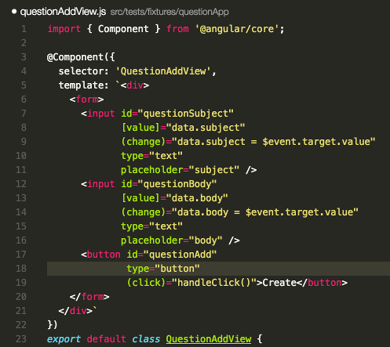

## language-vscode-javascript-angular2
This package is a language extension for Microsoft Visual Studio Code.  It extends the javascript and
typescript colorizers so that any template (text that appears within `` ` `` and `` ` `` characters) 
being assigned to a parameter named `template` within an object will be highlighted similar to how 
JSX syntax gets highlighted.

This is useful for syntax highlighting when you are using inline template definitions for Angular2.

Below is an example of what the colorizer looks like in action.

This extension uses modified copies of the javascript and typescript tmLanguage files from 
the [vscode](https://github.com/Microsoft/vscode) project.
